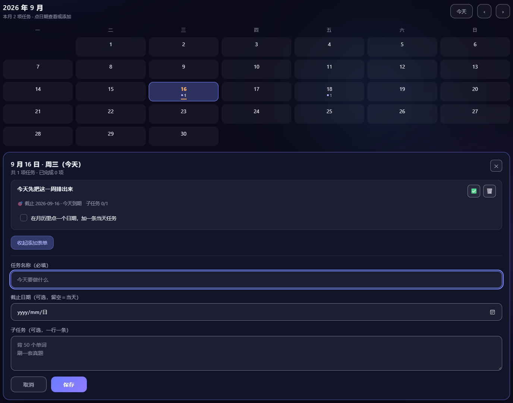

# FlagSaver · 立 Flag 倒计时屏保

> 一个 Windows 桌面「立 Flag」倒计时屏保：全屏展示你的目标清单与剩余天数，空闲自动浮现。
> 用 `pywebview`（HTML + Python）实现，界面暗色毛玻璃质感，可按拼音输入中文目标（普通桌面 IME 可用）。


---

## ⬇️ 下载（Windows 免安装）

**最新版：[v1.2.0](https://github.com/ZhangJie86889/FlagSaver/releases/tag/v1.2.0)**

| 文件 | 说明 |
|---|---|
| **[FlagSaver-Windows-v1.2.0.zip](https://github.com/ZhangJie86889/FlagSaver/releases/download/v1.2.0/FlagSaver-Windows-v1.2.0.zip)** ⭐ | 推荐。解压即用，内含 exe + `flag.html` + 中文《使用说明》 |
| [FlagSaver.exe](https://github.com/ZhangJie86889/FlagSaver/releases/download/v1.2.0/FlagSaver.exe) | 单文件程序，需自行把 `flag.html` 放在同目录 |

### 📦 历史版本（长期保留，随时可回退）

每个版本的 zip 与 exe 都**一直留在 Releases 上，不会被新版覆盖**。

| 版本 | 发布 | 免安装包 | 单文件 exe |
|---|---|---|---|
| **v1.2.0** | 2026-09-16 | [zip](https://github.com/ZhangJie86889/FlagSaver/releases/download/v1.2.0/FlagSaver-Windows-v1.2.0.zip) | [exe](https://github.com/ZhangJie86889/FlagSaver/releases/download/v1.2.0/FlagSaver.exe) |
| v1.1.1 | 2026-09-14 | [zip](https://github.com/ZhangJie86889/FlagSaver/releases/download/v1.1.1/FlagSaver-Windows-v1.1.1.zip) | [exe](https://github.com/ZhangJie86889/FlagSaver/releases/download/v1.1.1/FlagSaver.exe) |
| v1.1.0 | 2026-09-09 | [zip](https://github.com/ZhangJie86889/FlagSaver/releases/download/v1.1.0/FlagSaver-Windows-v1.1.0.zip) | [exe](https://github.com/ZhangJie86889/FlagSaver/releases/download/v1.1.0/FlagSaver.exe) |
| v1.0.0 | 2026-09-09 | [zip](https://github.com/ZhangJie86889/FlagSaver/releases/download/v1.0.0/FlagSaver-Windows-v1.0.0.zip) | [exe](https://github.com/ZhangJie86889/FlagSaver/releases/download/v1.0.0/FlagSaver.exe) |

回退时按这个选：

| 版本 | 有什么 | 缺什么 |
|---|---|---|
| **v1.2.0** | 月历视图、当天任务面板、`plan_date` 计划执行日；含 v1.1.1 全部修复 | —— |
| v1.1.1 | 重复双击 exe 会把已有窗口**呼出来**；热键不再「用着用着哑掉」；日志带日期；设计 Token + 对比度 + 键盘焦点 + 内联校验 | 无月历 |
| v1.1.0 | 全局热键、可视化设置面板、定时弹出、开机自启 | 无 v1.1.1 的健壮性修复，无月历 |
| v1.0.0 | 初版：时钟 + Flag 卡片 + 立 Flag 表单 | 无热键、无设置面板 |

> ⚠️ **exe 体积分两档，是构建环境不同**：v1.0.0 / v1.1.0 / v1.2.0 约 18.5 MB
> （Python 3.14 + pywebview 6.2.1 + pythonnet），v1.1.1 为 14.1 MB（更精简的环境）。
> 功能一致；万一某台机器上某一档跑不起来，换另一档试 —— 这也是保留全部历史版本的意义之一。
>
> 💡 各版本的 zip/exe 同时在本机 `_releases/<版本>/` 留了一份归档（含 sha256 校验清单），
> 该目录不进 Git，见 `.gitignore`。

**三步跑起来**：下载 zip → 解压到任意文件夹 → 双击 `FlagSaver.exe`。
> 首次运行若被 Windows SmartScreen / 智能应用控制拦截，见下方 [双击 exe 没反应](#-设置面板--关联-windows-系统)。
> 想让它在空闲时自动弹出，见下方 [设为开机自启](#-设为开机自启)。

---

## ✨ 特性

- 🗓️ **月历视图**：主界面内嵌月历，点某一天即可查看/添加「当天任务」；有任务的日期显示圆点 + 数量
- 🖥️ **全屏屏保**：空闲到点自动全屏浮现；按 `Esc` 或点 ✕ 立即隐藏
- ⌨️ **全局热键**：默认 `Ctrl+Alt+G`，Windows 任何界面按一下即呼出，再按隐藏（冲突自动顺延）
- ⏰ **定时弹出**：可设每天固定时刻（如 22:30）自动全屏
- 🔧 **可视化设置**：右上角 ⚙ 面板改空闲时间 / 热键 / 定时 / 开机自启，立即生效，无需重打包
- 🚀 **开机自启**：一键写入 Windows 注册表启动项
- 🎯 **立 Flag**：输入目标 + 截止日期，自动计算剩余天数；支持子任务勾选
- 🏷️ **完成态卡片**：到期的 Flag 卡片变色提醒，一目了然
- ⌨️ **中文输入友好**：运行在普通桌面（非系统 `.scr` 安全桌面），拼音输入法正常可用
- 💾 **本地保存**：数据存 `flag_data.json`，与程序同目录，可整体拷贝、跨机器使用
- 🌐 **浏览器可预览**：单独用 Edge 打开 `flag.html` 也能跑（localStorage / 文件访问降级）

## 🗓️ 月历视图（v1.2.0 新增）



月历放在 Flag 卡片**下方**，随内容区一起受 1400px 限宽居中。

**点日期 → 打开当天面板**：看这一天的任务（标题、剩余/逾期天数、子任务勾选、完成态），
面板里的「＋ 添加当天任务」可以当场加一条 —— 名称必填、截止日可选、子任务可选（一行一条）。

保存后任务立刻出现在当天列表里，月历上的圆点/数量同步刷新，面板保持打开以便继续加。

**日期格上的标记**：有任务的日子显示 `· 数量`，当天任务全部完成时圆点转为绿色；
今天用暖色数字 + 底部横条标注，不依赖单一颜色传达状态。

**两个日期字段不混用**：

| 字段 | 含义 | 显示位置 |
|---|---|---|
| `date` | 这件事什么时候**到期** | 卡片上的「🎯 截止 …」与剩余天数 |
| `plan_date` | 打算哪一天**动手** | 月历上的位置 |

两者不同时，卡片会多显示一行 `📅 计划 …`。例如「计划 12-20 复盘错题，截止 12-30」，
这条 Flag 会出现在月历的 12-20 那天，卡片上同时标出计划日与截止日。

> **升级友好**：老数据没有 `plan_date` 时会在读取阶段**回退到 `date`**，
> 所以旧 Flag 会照常出现在它原来那个日期的格子上 —— 不报错、不消失、不需要手动迁移。
> 第一次打开后文件里会多出一个 `"plan_date": ""` 字段，属正常现象。

### 键盘操作

| 按键 | 行为 |
|---|---|
| `Tab` | 进入/离开月历（整个网格只有一个 Tab 停靠点，不必按 30 次） |
| `←` `→` | 前一天 / 后一天（跨月自动切换月份） |
| `↑` `↓` | 前一周 / 后一周 |
| `Home` / `End` | 本周一 / 本周日 |
| `PageUp` / `PageDown` | 上一个月 / 下一个月（月末自动收敛：1/31 → 2/28） |
| `Enter` / `Space` | 打开当天面板 |
| `Esc` | **关闭当天面板**（面板关闭后，`Esc` 才恢复为「隐藏屏保」） |

> `Esc` 的优先级是：设置面板（⚙）> 当天面板 > 隐藏屏保。上一层没打开时，`Esc` 的原有行为完全不受影响。

## 🩹 v1.1.1 修复了什么


`saver_window.py` 的健壮性修复，都是实际踩出来的坑：

| # | 问题 | 修复 |
|---|---|---|
| 1 | 程序已在后台运行时**再双击 exe 毫无反应**（`already_running()` 直接 `sys.exit(0)`） | 改用命名事件通知已有实例**把窗口呼出来**，再退出本进程 |
| 2 | 热键线程里直接操作窗口，一旦卡住就**再也收不到热键**（且空闲弹出仍正常，极难排查） | 热键线程只收消息并入队，窗口显隐交给单独线程串行执行，且带超时保护 |
| 3 | 大量 `except Exception: pass` 把错误**全部吞掉**，出问题零线索 | 所有异常一律写日志 |
| 4 | 日志只有 `时:分:秒`，**跨天无法定位** | 改为 `年-月-日 时:分:秒` |
| 5 | 热键被占用自动顺延后，**用户不知道实际生效的是哪个键** | 实际键落 `config.json` 的 `hotkey_active`、设置面板显示真实键、启动时弹提示 |
| 6 | 单实例互斥量用 `Global\` 命名，**非管理员可能创建失败**导致单实例失效 | 改用 `Local\` |
| 7 | 顺延备选表里 `ctrl+alt+d/s/f/1` 在输入法、截图工具、QQ/微信里**普遍被占**，顺延过去基本白试 | 换成 `win+shift+*` / `ctrl+shift+*` / `F9` 这类冷门组合 |
| 8 | 次级小字对比度只有 **3.2:1**、底部小字 **2.1:1**，完成态卡片整体降透明度后更低 | 逐项提到 ≥4.5:1（详见下方「设计与可访问性」） |
| 9 | 输入框写了 `outline: none`，键盘用户看不出焦点在哪 | 统一 `:focus-visible` 焦点环 |
| 10 | 添加 Flag 出错只弹一句 toast，不说是哪个字段；过去的日期能直接提交 | 改为**字段下方内联报错**，并拦截早于今天的截止日期 |
| 11 | 设置面板「保存」随时可点，「取消」直接丢弃改动 | 无改动时禁用保存、提交中显示「保存中…」；取消前二次确认 |
| 12 | 毛玻璃 `backdrop-filter` 用到 18px，全屏大面积模糊开销大 | 统一到 `--glass-blur: 10px` |

> 完整说明见 [`CHANGELOG_v1.1.1.md`](CHANGELOG_v1.1.1.md)。

## 🎨 设计与可访问性

界面统一建立在 `:root` 的**设计 Token** 上（4px 间距网格、语义化色彩、圆角、毛玻璃、焦点环），
不再到处写死 `#hex` 与零散 `px`。旧短变量名保留为别名，便于渐进演进。

针对暗色毛玻璃主题专门处理的可访问性问题：

| 项目 | 结果 |
|---|---|
| 正文 / 次级文字对比度 | ≥ 4.5:1（WCAG AA）；月历相关 24 项色对实测全部达标（详见 [`CHANGELOG_v1.2.0.md`](CHANGELOG_v1.2.0.md)） |
| 时钟等大号文字 | ≥ 3:1 |
| 图标、输入框边框等非文本元素 | ≥ 3:1（含月历日期格边框、面板边界 3.10:1） |
| 键盘焦点 | 全组件统一 `:focus-visible` 焦点环（6.6:1），面板内 `Tab` 循环、关闭后焦点还原 |
| 月历键盘可用 | roving tabindex + 方向键 / `Home` / `End` / `PageUp` / `PageDown` / `Enter` / `Esc` 全通 |
| 状态标识 | 「已完成」= 颜色 + 对勾图标 + 文字；日期格任务数 = 圆点 + 数字，均不只依赖颜色 |
| 动效偏好 | 尊重 `prefers-reduced-motion`，停止光晕漂移与装饰动画，滚入改为瞬时定位 |
| 屏幕阅读器 | 跳转链接、`sr-only` 标签、`aria-live` 状态播报（含月历切换/新增/删除）、`role="progressbar"`、日期格带完整 `aria-label` |
| 响应式 | 卡片 `auto-fill` 自适应列数；内容区超宽屏限宽 1400px 居中；月历 `minmax(0,1fr)` 七列，480px 窄屏无横向滚动 |

## 📁 文件说明

| 文件 | 作用 |
|---|---|
| `saver_window.py` | 主程序源码（pywebview 窗口 + 空闲检测 + JS API） |
| `flag.html` | 界面（时钟 / Flag 卡片 / 月历视图 / 立 Flag 表单），纯前端 |
| `flag_data.json` | 你的 Flag 数据（**不入库**，见 `.gitignore`） |
| `flag_data.example.json` | 示例数据，别人 clone 后参考用 |
| `build_zip.py` | 打 Windows 发布压缩包 |
| `CHANGELOG_v1.2.0.md` / `CHANGELOG_v1.1.1.md` | 各版本更新说明 |

## 🗂️ 数据格式

`flag_data.json` 是一个数组，每条 Flag 长这样：

```json
[
  {
    "id": "mt9z38r5j5n99",
    "name": "嘉立创初级报名",
    "date": "2026-09-18",
    "plan_date": "2026-09-16",
    "completed": false,
    "subtasks": [
      { "id": "a1", "text": "准备好材料", "done": true }
    ]
  }
]
```

| 字段 | 类型 | 说明 |
|---|---|---|
| `id` | string | 主键，缺失会自动补 |
| `name` | string | 名称，缺失补 `未命名 Flag` |
| `date` | `"YYYY-MM-DD"` | **截止日**（卡片上的倒计时） |
| `plan_date` | `"YYYY-MM-DD"` | **计划执行日**（月历上的位置）；**缺失时回退到 `date`**，因此老数据无需迁移 |
| `completed` | bool | 是否完成 |
| `subtasks` | array | `{ id, text, done }`，子任务 |

> 日期一律按**本地日期**处理，不做时区换算。

## 🚀 运行方式

### 双模式

| 方式 | 行为 |
|---|---|
| `FlagSaver.exe`（双击） | 启动后**立即全屏显示** |
| `FlagSaver.exe /bg` | 后台常驻，**空闲到点**后自动全屏（默认 5 分钟，可在 ⚙ 设置里改） |
| 程序已在后台时再双击 | **把已有窗口呼出来**（不会重复开第二个进程，也不会毫无反应） |

> 无论哪种模式，都可以随时用全局热键（默认 `Ctrl+Alt+G`）呼出/隐藏。
>
> **单实例**：同一时间只允许一个实例运行。已在后台运行时再双击 exe，程序不会静默退出，
> 而是通知已有实例把窗口显示出来 —— 所以你随时双击图标都能把屏保叫出来。

### 源码运行

```bash
# 安装依赖
pip install pywebview

# 直接运行（需要 Python 3.x）
python saver_window.py            # 立即全屏
python saver_window.py /bg        # 后台，空闲自动弹
```

### 打包成 exe

```bash
pip install pyinstaller
pyinstaller --onefile --noconsole --name FlagSaver saver_window.py
```

> 打包后把 `flag.html` 和 `FlagSaver.exe` 放到**同一目录**即可使用（数据会自动生成 `flag_data.json`）。

### 打 Windows 发布包

```bash
python build_zip.py     # 生成 _zip_out/FlagSaver-Windows-v1.2.0.zip（exe + flag.html + 使用说明）
```

## 🚀 设为开机自启

1. `Win + R` 输入 `shell:startup` 回车，打开「启动」文件夹
2. 给 `FlagSaver.exe` 建一个快捷方式拖进去
3. 右键该快捷方式 → 属性 →「目标」末尾加 ` /bg`，例如：`"D:\FlagSaver\FlagSaver.exe" /bg`

> 等效命令行：`reg add "HKCU\Software\Microsoft\Windows\CurrentVersion\Run" /v FlagSaver /t REG_SZ /d "\"D:\FlagSaver\FlagSaver.exe\" /bg" /f`

## ⚙️ 设置面板 & 关联 Windows 系统

界面右上角 **⚙** 打开设置，改完立刻生效，配置写入程序目录的 `config.json`：


| 选项 | 说明 | 关联到 Windows 的方式 |
|---|---|---|
| **空闲多久弹出** | 单位分钟，`0` = 关闭空闲弹出 | `GetLastInputInfo` 读系统空闲时长 |
| **全局热键** | 默认 `ctrl+alt+g`，任何界面按下即呼出，再按一次隐藏 | `RegisterHotKey` 系统级注册；**若与其它软件冲突会自动顺延**到下一个可用组合 |
| **每天定时弹出** | 例如 `22:30`，留空关闭 | 本地时间比对，每天触发一次 |
| **开机自启** | 勾选即可 | 写 `HKCU\Software\Microsoft\Windows\CurrentVersion\Run\FlagSaver`（带 `/bg`） |

`config.json` 示例：

```json
{
  "idle_seconds": 300,
  "hotkey": "ctrl+alt+g",
  "auto_time": "22:30",
  "autostart": true,
  "hotkey_active": "win+shift+g"
}
```

> `hotkey_active` 是**本次实际注册成功**的热键。它和 `hotkey` 不一样，就说明 `hotkey`
> 被别的软件占用了、程序已自动顺延，设置面板会显示 `hotkey_active` 并给出提示。

> **热键按了没反应？** 按顺序查这三件事：
> 1. **程序在不在跑** —— 全局热键必须有常驻进程；任务管理器里看不到 `FlagSaver.exe` 时按什么都没用。
>    双击一下 exe 即可（已在后台时会直接把窗口呼出来）。
> 2. **你按的是不是实际生效的那个键** —— 设置面板里的热键被别的软件占用时，程序会**自动顺延**到下一个可用组合。
>    这种情况下 ⚙ 面板里显示的就是**实际生效的键**，程序启动时也会弹一次提示。按面板里显示的那个键。
> 3. 还是不行就看程序目录的 `flagsaver.log`（带日期），里面写明了注册成功的是哪个组合、以及有没有收到按键。

> **双击 exe 没反应？** 通常是这两种情况：
> ① 程序**已经在后台运行** —— 新版会把窗口呼出来；旧版（≤v1.1.0）会静默退出，看起来就像启动失败。
> ② 被 Windows **智能应用控制**拦下了 —— 本程序未签名，从网上下载的 exe 可能被拦。
>    右键 exe → 属性 → 勾选「解除锁定」；仍不行只能关闭智能应用控制（Win11，**关闭后不可再开启**）或改用源码运行。

## 📄 关于「屏保」

Windows 系统屏保 `.scr` 运行在独立安全桌面，**不加载中文输入法**，打不了拼音。
本项目改用「普通全屏窗口 + 空闲检测」替代：运行在普通桌面，IME 正常加载，因此能拼音输入中文目标。

## 🛠️ 技术栈

- [pywebview](https://pywebview.flowrl.com/) — Python 调 WebView 渲染 HTML
- 空闲检测：`GetLastInputInfo`（Win32）
- 打包：[PyInstaller](https://pyinstaller.org/) `--onefile --noconsole`

---

## 📜 License

[MIT](LICENSE) © 2026 [ZhangJie86889](https://github.com/ZhangJie86889)

_本工具仅供个人学习与娱乐使用。_
