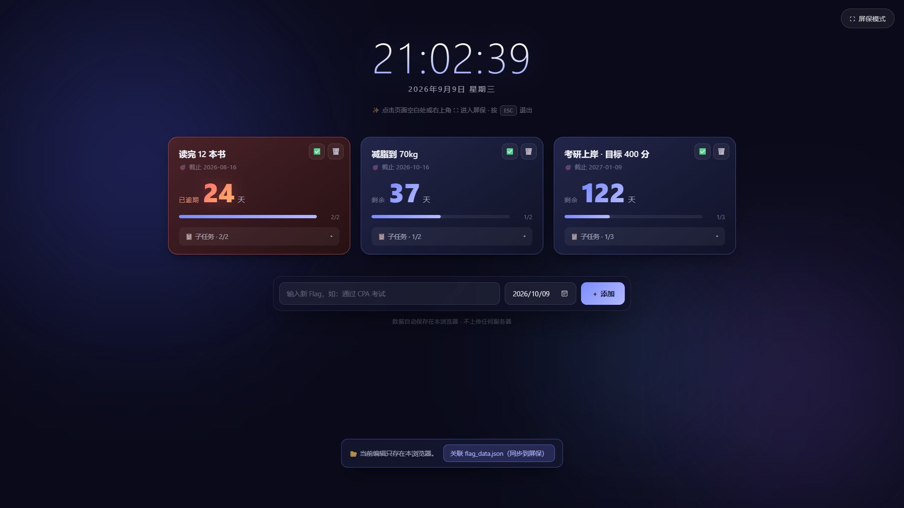

# FlagSaver · 立 Flag 倒计时屏保

> 一个 Windows 桌面「立 Flag」倒计时屏保：全屏展示你的目标清单与剩余天数，空闲自动浮现。
> 用 `pywebview`（HTML + Python）实现，界面暗色毛玻璃质感，可按拼音输入中文目标（普通桌面 IME 可用）。



---

## ⬇️ 下载（Windows 免安装）

| 文件 | 说明 |
|---|---|
| **[FlagSaver-Windows-v1.0.0.zip](https://github.com/ZhangJie86889/FlagSaver/releases/download/v1.0.0/FlagSaver-Windows-v1.0.0.zip)** ⭐ | 推荐。解压即用，内含 exe + `flag.html` + 中文《使用说明》 |
| [FlagSaver.exe](https://github.com/ZhangJie86889/FlagSaver/releases/download/v1.0.0/FlagSaver.exe) | 单文件程序，需自行把 `flag.html` 放在同目录 |

**三步跑起来**：下载 zip → 解压到任意文件夹 → 双击 `FlagSaver.exe`。
> 首次运行若被 Windows SmartScreen 拦截，点「详细信息 → 仍要运行」。
> 想让它在空闲时自动弹出，见下方 [设为开机自启](#-设为开机自启)。

---

## ✨ 特性

- 🖥️ **全屏屏保**：空闲 5 分钟自动全屏浮现；按 `Esc` 或点 ✕ 立即隐藏
- 🎯 **立 Flag**：输入目标 + 截止日期，自动计算剩余天数；支持子任务勾选
- 🏷️ **完成态卡片**：到期的 Flag 卡片变色提醒，一目了然
- ⌨️ **中文输入友好**：运行在普通桌面（非系统 `.scr` 安全桌面），拼音输入法正常可用
- 💾 **本地保存**：数据存 `flag_data.json`，与程序同目录，可整体拷贝、跨机器使用
- 🌐 **浏览器可预览**：单独用 Edge 打开 `flag.html` 也能跑（localStorage / 文件访问降级）

## 📁 文件说明

| 文件 | 作用 |
|---|---|
| `saver_window.py` | 主程序源码（pywebview 窗口 + 空闲检测 + JS API） |
| `flag.html` | 界面（时钟 / Flag 卡片 / 立 Flag 表单），纯前端 |
| `flag_data.json` | 你的 Flag 数据（**不入库**，见 `.gitignore`） |
| `flag_data.example.json` | 示例数据，别人 clone 后参考用 |

## 🚀 运行方式

### 双模式

| 方式 | 行为 |
|---|---|
| `FlagSaver.exe`（双击） | 启动后**立即全屏显示** |
| `FlagSaver.exe /bg` | 后台常驻，**空闲 5 分钟**后自动全屏（适合开机自启） |

### 源码运行

```bash
# 安装依赖
pip install pywebview

# 直接运行（需要 Python 3.x）
python saver_window.py            # 立即全屏
python saver_window.py /bg        # 后台，空闲自动弹
```

### 打包成 exe

```bash
pip install pyinstaller
pyinstaller --onefile --noconsole --name FlagSaver saver_window.py
```

> 打包后把 `flag.html` 和 `FlagSaver.exe` 放到**同一目录**即可使用（数据会自动生成 `flag_data.json`）。

### 打 Windows 发布包

```bash
python build_zip.py     # 生成 _zip_out/FlagSaver-Windows-v1.0.0.zip（exe + flag.html + 使用说明）
```

## 🚀 设为开机自启

1. `Win + R` 输入 `shell:startup` 回车，打开「启动」文件夹
2. 给 `FlagSaver.exe` 建一个快捷方式拖进去
3. 右键该快捷方式 → 属性 →「目标」末尾加 ` /bg`，例如：`"D:\FlagSaver\FlagSaver.exe" /bg`

> 等效命令行：`reg add "HKCU\Software\Microsoft\Windows\CurrentVersion\Run" /v FlagSaver /t REG_SZ /d "\"D:\FlagSaver\FlagSaver.exe\" /bg" /f`

## 🎛️ 配置

- **空闲触发时间**：`saver_window.py` 中 `IDLE_SECONDS = 5 * 60`，改后重新打包
- **开机自启**：把 `"...\FlagSaver.exe" /bg` 加入注册表 `HKCU\Software\Microsoft\Windows\CurrentVersion\Run`（或任务管理器「启动」）

## 📄 关于「屏保」

Windows 系统屏保 `.scr` 运行在独立安全桌面，**不加载中文输入法**，打不了拼音。
本项目改用「普通全屏窗口 + 空闲检测」替代：运行在普通桌面，IME 正常加载，因此能拼音输入中文目标。

## 🛠️ 技术栈

- [pywebview](https://pywebview.flowrl.com/) — Python 调 WebView 渲染 HTML
- 空闲检测：`GetLastInputInfo`（Win32）
- 打包：[PyInstaller](https://pyinstaller.org/) `--onefile --noconsole`

---

## 📜 License

[MIT](LICENSE) © 2026 [ZhangJie86889](https://github.com/ZhangJie86889)

_本工具仅供个人学习与娱乐使用。_
